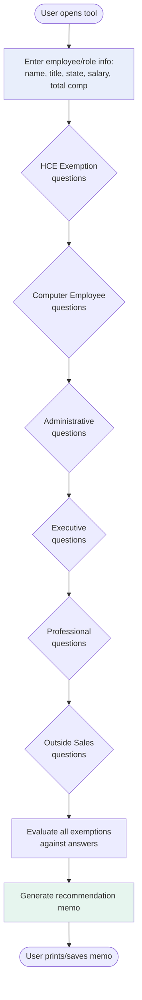

# 01 — Overview

## Mission

The FLSA Exemption Classification Tool helps a People Operations team determine whether US employees should be classified as **exempt** (not entitled to overtime pay) or **non-exempt** (entitled to overtime pay) under the Fair Labor Standards Act (FLSA) and applicable state law.

The tool walks a user through a guided questionnaire, evaluates the employee's job duties and compensation against federal and state exemption rules, and produces a detailed recommendation memo that documents the reasoning chain. The memo is suitable for internal audit documentation and IPO-readiness evidence.

## Problem Being Solved

Most companies classify employees using vibes, job titles, or "whatever the industry does." This creates significant legal and financial risk:

- **Misclassifying a non-exempt employee as exempt** results in unpaid overtime liability (up to 2-3 years of back pay, plus liquidated damages equal to the unpaid amount, plus attorney's fees)
- **State-level misclassification** can result in additional penalties (California's PAGA claims, for example)
- **For a pre-IPO company**, classification issues surface in diligence and can delay or complicate offerings

The tool replaces informal classification with a documented, repeatable process that:
1. Forces the user to evaluate EVERY relevant exemption, not just the obvious one
2. Applies the MORE protective of federal or state standards
3. Flags borderline cases for legal review rather than rubber-stamping them
4. Produces an audit trail

## Success Criteria

A successful rebuild must enable a user to:

1. **Complete a new hire classification** in under 10 minutes
2. **Complete a reclassification review** with the same flow
3. **Generate a printable memo** that documents every exemption tested and the outcome
4. **Understand why the tool reached its conclusion** through visible reasoning (not a black box)
5. **Handle state-specific rules** for the high-impact states (CA, NY, WA, CO, CT, OR, ME)
6. **Flag borderline cases** for legal review rather than forcing a clean pass/fail

## Users

**Primary users:**
- People Operations associates and managers
- People Business Partners (PBPs)

**Secondary users:**
- Hiring managers (occasionally, for new hire decisions)
- Employment counsel (reviewing flagged cases)

**NOT users:**
- Employees themselves (this is an internal HR tool)
- External auditors (though they may review the output)

## Scope

### In Scope

- Federal FLSA exemption evaluation for these categories:
  - Highly Compensated Employee (HCE)
  - Computer Employee
  - Administrative
  - Executive
  - Learned Professional
  - Outside Sales
- State overlay for: California, New York, Washington, Colorado, Connecticut, Oregon, Maine
- New hire classifications
- Reclassification reviews
- Printable recommendation memo
- Regulatory landscape reference tab

### Out of Scope

- Independent contractor classification (different legal test)
- Exempt categories not commonly found in fintech (agricultural, motor carrier, railroad, seasonal amusement, etc.)
- States other than those listed above (default to federal rules with a flag)
- Benefits eligibility (exempt status doesn't determine benefits)
- FMLA, ADA, or other employment law compliance (those are separate tools)
- Wage calculation, payroll, or timekeeping
- Documenting actual hours worked for non-exempt employees

## Tool Output

The tool produces one primary artifact: a **Classification Recommendation Memo**. This memo includes:

1. Employee/role information
2. Classification recommendation (EXEMPT under specific exemption, NON-EXEMPT, or LEGAL REVIEW REQUIRED)
3. Exemption-by-exemption analysis showing pass/fail/borderline for each tested category
4. Applicable overtime rules (if non-exempt)
5. Risk flags for borderline determinations or state-specific concerns
6. Standard legal disclaimer
7. Generation date and tool version date

The memo is designed for:
- **Audit documentation:** Retain in employee file or classification records
- **Legal review:** When sent to counsel for borderline cases, the memo explains what the tool tested
- **IPO diligence:** Evidence of systematic classification practice

## Non-Goals

The tool is explicitly NOT:

1. **A decision-maker.** The user makes the final classification decision. The tool provides analysis.
2. **A legal authority.** Consult employment counsel for borderline or novel situations.
3. **A workflow tool.** It doesn't route memos for approval, notify stakeholders, or integrate with HRIS.
4. **A bulk processor.** Users classify one employee at a time.
5. **A learning tool.** It doesn't teach FLSA law; it applies it. Users should have baseline familiarity.

## Guiding Principles

When implementing the tool, apply these principles:

1. **Transparency over brevity.** Show the user what the tool is testing and why. Don't hide reasoning.
2. **Conservative over aggressive.** When in doubt, flag for legal review. Don't default to "exempt."
3. **State law over federal law when stricter.** Always apply the more protective standard.
4. **Document the negative space.** Show what didn't qualify and why, not just the recommended exemption.
5. **No legal jargon without explanation.** The audience is HR, not lawyers. Inline-define terms.
6. **Professional, not flashy.** This is a compliance tool. Looks like an internal HR product, not a marketing page.

## High-Level User Flow

Note: Questions within each exemption are conditional. If an early gate fails (e.g., salary too low), subsequent questions for that exemption are skipped but the outcome is still recorded.

Continue to `02-regulatory-context.md`.
