# 05 — Decision Tree

This document specifies every question in the tool, verbatim, with exact option labels, skip logic, and auto-answer conditions. A builder must reproduce the text exactly as specified, with no paraphrasing.

---

## Question Object Schema

Each question has the following fields:

| Field | Type | Required | Purpose |
|-------|------|----------|---------|
| `id` | string | Yes | Unique identifier used for answer storage and skipIf references |
| `exemption` | string | Yes | Badge label: "HCE", "Computer", "Administrative", "Executive", "Professional", or "Sales" |
| `stageIdx` | number | Yes | Progress bar stage (1-5); Outside Sales uses 5 |
| `label` | string | Yes | Main question text (bold heading) |
| `text` | string | Yes | Detailed explanation below the heading |
| `help` | string | No | Extended guidance shown below the text |
| `why` | string | No | "Why are we asking this?" content shown in collapsible toggle |
| `options` | array | Yes | Answer choices, each with `value` and `label` |
| `skipIf` | function | No | Returns true to skip this question based on prior answers |
| `autoAnswer` | string | No | Pre-selected value based on data-derived conditions |

---

## Question Flow Diagram

```mermaid
flowchart TD
    Start([Employee Info Complete]) --> H1[hce_start:<br/>Total comp ≥ $107,432?]

    H1 -- Yes --> H1a{CT state?}
    H1 -- No --> C1

    H1a -- Yes --> H_CT[hce_ct_block:<br/>CT doesn't recognize HCE]
    H1a -- No --> H2[hce_office:<br/>Office/non-manual work?]
    H_CT --> C1

    H2 -- Yes --> H3[hce_one_duty:<br/>One exempt duty?]
    H2 -- No --> C1
    H3 --> C1

    C1[comp_role:<br/>Computer-related role?]
    C1 -- Yes --> C2[comp_salary:<br/>Meets comp threshold?]
    C1 -- No --> A1
    C2 -- Yes/Federal-only --> C3[comp_duties:<br/>Primary duty match?]
    C2 -- No --> A1
    C3 -- Match --> C4[comp_independent:<br/>Independent work?]
    C3 -- None --> A1
    C4 --> A1

    A1[admin_salary:<br/>Meets admin salary threshold?]
    A1 -- Yes --> A2[admin_biz_ops:<br/>Biz ops or customer ops?]
    A1 -- No --> E1
    A2 -- Not Production --> A3{Strict admin state?}
    A2 -- Production --> E1
    A3 -- Yes --> A_S[admin_state_restrict:<br/>NY/OR warning]
    A3 -- No --> A4[admin_discretion:<br/>Discretion & judgment?]
    A_S --> A4
    A4 --> E1

    E1[exec_salary:<br/>Meets exec salary threshold?]
    E1 -- Yes --> E2[exec_manage:<br/>Primary duty is management?]
    E1 -- No --> P1
    E2 -- Yes/Partial --> E3[exec_reports:<br/>2+ FTE reports?]
    E2 -- No --> P1
    E3 -- Yes --> E4[exec_hire_fire:<br/>Hire/fire authority?]
    E3 -- No --> P1
    E4 --> P1

    P1[prof_salary:<br/>Meets prof salary threshold?]
    P1 -- Yes --> P2[prof_advanced:<br/>Advanced knowledge?]
    P1 -- No --> S1
    P2 --> S1

    S1[sales_check:<br/>Sales or BD role?]
    S1 -- Yes --> S2[sales_outside:<br/>Outside sales primary duty?]
    S1 -- No --> End
    S2 --> End([Evaluate exemptions])
```



---

## HCE Exemption Questions

### Q1: `hce_start`

- **Exemption badge:** HCE
- **Stage:** 1
- **Auto-answer:** "yes" if `empData.totalComp >= FEDERAL_HCE_THRESHOLD`, else "no"

**Label:**
```
Highly Compensated Employee (HCE) Exemption
```

**Text:**
```
Does this employee earn total annual compensation of $107,432 or more? (Current total comp entered: $[TOTAL_COMP])
```

Where `[TOTAL_COMP]` is replaced with the comma-formatted total comp value.

**Help:**
```
Total comp includes salary, nondiscretionary bonuses, commissions, and other nondiscretionary compensation. Equity/stock value at grant is generally not included unless it vests and is paid annually.
```

**Why:**
```
The HCE exemption uses a reduced duties test. If the employee earns above this threshold, they only need to perform one exempt duty (executive, administrative, or professional) on a customary and regular basis.
```

**Options:**
```
- value: "yes"   label: "Yes, total comp is ≥ $107,432/year"
- value: "no"    label: "No, total comp is below $107,432/year"
```

### Q2: `hce_ct_block` (Conditional: only if Connecticut)

- **Exemption badge:** HCE
- **Stage:** 1

**Shown only when:** `workState` maps to `connecticut`

**Label:**
```
Connecticut does not recognize the HCE exemption
```

**Text:**
```
This employee works in Connecticut, which does not recognize the federal HCE exemption. The employee must qualify under one of the standard exemptions (Administrative, Executive, Professional, or Computer Employee) regardless of compensation level.
```

**Help:** (none)

**Why:**
```
Connecticut state law requires employees to meet the full duties test for a specific exemption. High compensation alone is not sufficient.
```

**Options:**
```
- value: "acknowledged"   label: "Understood, continue to next exemption"
```

### Q3: `hce_office`

- **Exemption badge:** HCE
- **Stage:** 1
- **Skip if:** `answers.hce_start === "no"` OR `stateKey === "connecticut"`

**Label:**
```
Does this employee perform office or non-manual work as their primary duty?
```

**Text:**
```
The HCE exemption does not apply to manual laborers, production workers, maintenance staff, construction workers, or similar "blue collar" roles, regardless of pay.
```

**Help:**
```
Office/non-manual work includes desk-based roles like management, analysis, programming, administration, consulting, and professional services.
```

**Why:**
```
Even highly paid employees who primarily do physical/manual work cannot be exempt under HCE.
```

**Options:**
```
- value: "yes"   label: "Yes, primarily office or non-manual work"
- value: "no"    label: "No, primarily manual or physical work"
```

### Q4: `hce_one_duty`

- **Exemption badge:** HCE
- **Stage:** 1
- **Skip if:** `answers.hce_start === "no"` OR `answers.hce_office === "no"` OR `stateKey === "connecticut"`

**Label:**
```
Does this employee customarily and regularly perform at least ONE of the following exempt duties?
```

**Text:**
```
Select the one that best applies. Under HCE, the employee only needs to meet one duty from any exempt category on a regular basis (not just occasionally).
```

**Help:** (none)

**Why:**
```
The HCE exemption uses a relaxed duties test. Instead of meeting ALL requirements of an exemption, the employee only needs to customarily and regularly perform at least one exempt duty.
```

**Options:**
```
- value: "manages"            label: "Manages the enterprise or a department, OR directs the work of 2+ employees"
- value: "admin_discretion"   label: "Performs work directly related to management/business operations AND exercises discretion and independent judgment on significant matters"
- value: "advanced_knowledge" label: "Performs work requiring advanced knowledge in a field of science/learning acquired through specialized education"
- value: "none"               label: "None of the above apply on a customary and regular basis"
```

---

## Computer Employee Questions

### Q5: `comp_role`

- **Exemption badge:** Computer
- **Stage:** 2

**Label:**
```
Is this employee in a computer-related role?
```

**Text:**
```
The computer employee exemption applies to systems analysts, programmers, software engineers, and similar roles. It does NOT apply to employees who simply use computers as tools (e.g., data entry, using spreadsheets, CAD operators, writers).
```

**Help:**
```
Common qualifying titles at a fintech company: Software Engineer, DevOps Engineer, SRE, Blockchain Developer, Protocol Engineer, Platform Engineer, QA Automation Engineer (if primarily writing test code). Common NON-qualifying roles: IT Help Desk, Hardware Technician, Data Entry, roles that just use software.
```

**Why:**
```
This is the threshold question for the computer employee exemption. If the role is not fundamentally a computer science/engineering role, we skip this exemption entirely.
```

**Options:**
```
- value: "yes"   label: "Yes, this is a software/systems/programming role"
- value: "no"    label: "No, this employee uses computers but is not in a computer science/engineering role"
```

### Q6: `comp_salary`

- **Exemption badge:** Computer
- **Stage:** 2
- **Skip if:** `answers.comp_role === "no"`

**Label:**
```
Does this employee meet the computer employee compensation threshold?
```

**Text (dynamic based on state):**

Base text:
```
Federal: salary ≥ $684/week ($35,568/year) OR hourly rate ≥ $27.63/hour.
```

If `stateKey === "california"`, append:
```
California (applies here): salary ≥ $122,573.13/year OR hourly rate ≥ $58.85/hour.
```

If `stateKey === "colorado"`, append:
```
Colorado (applies here): salary ≥ $57,784/year OR hourly rate ≥ $34.85/hour.
```

If `stateKey === "washington"`, append:
```
Washington (applies here): hourly rate ≥ $59.96/hour.
```

Always append (at end):
```
Entered salary: $[BASE_SALARY]/year[, $[HOURLY_RATE]/hour if hourly entered]
```

**Help:**
```
Apply the MORE protective (higher) threshold between federal and state.
```

**Why:**
```
Both salary/fee basis and hourly rate alternatives exist for the computer employee exemption. The employee must meet at least one.
```

**Options:**
```
- value: "yes"            label: "Yes, meets both federal AND applicable state threshold"
- value: "federal_only"   label: "Meets federal threshold but NOT state threshold"
- value: "no"             label: "Does not meet the federal threshold"
```

### Q7: `comp_duties`

- **Exemption badge:** Computer
- **Stage:** 2
- **Skip if:** `answers.comp_role === "no"` OR `answers.comp_salary === "no"`

**Label:**
```
What is this employee's PRIMARY duty? Select the best match.
```

**Text:**
```
The computer employee exemption requires the primary duty to consist of one or more of these specific functions. "Primary duty" means the principal, main, or most important duty performed.
```

**Help:** (none)

**Why:**
```
Job titles do not determine exemption status. The actual work performed must match one of these specific categories defined in the FLSA regulations.
```

**Options:**
```
- value: "systems_analysis"   label: "Applying systems analysis techniques and procedures (consulting with users to determine hardware/software/system functional specifications)"
- value: "design_dev"         label: "Designing, developing, documenting, analyzing, creating, testing, or modifying computer systems or programs, including prototypes, based on user or system design specifications"
- value: "os_programs"        label: "Designing, documenting, testing, creating, or modifying computer programs related to machine operating systems"
- value: "combination"        label: "A combination of the above duties, requiring the same level of skills"
- value: "none"               label: "None of the above accurately describe this employee's primary duties (e.g., hardware repair, help desk support, QA manual testing, using software as a tool)"
```

### Q8: `comp_independent`

- **Exemption badge:** Computer
- **Stage:** 2
- **Skip if:** `answers.comp_role === "no"` OR `answers.comp_salary === "no"` OR `answers.comp_duties === "none"`

**Label:**
```
Does this employee work independently, without close supervision, using a high level of skill and expertise?
```

**Text:**
```
The exemption does not apply to entry-level employees who have not yet attained the skill level needed to work independently. Consider: does this person make independent technical decisions, or do they primarily follow detailed instructions from a senior engineer?
```

**Help:**
```
Junior/entry-level developers who work under close supervision and primarily implement detailed specifications written by others may not qualify.
```

**Why:**
```
Both federal and state (especially California) exemptions require the employee to be highly skilled and capable of independent work. This is where many junior roles fail the test.
```

**Options:**
```
- value: "yes"       label: "Yes, works independently with high-level skills and expertise"
- value: "partial"   label: "Somewhat, has developing skills but still requires significant supervision on major decisions"
- value: "no"        label: "No, this is an entry-level or closely supervised role"
```

---

## Administrative Exemption Questions

### Q9: `admin_salary`

- **Exemption badge:** Administrative
- **Stage:** 3

**Label:**
```
Does this employee meet the salary threshold for the administrative exemption?
```

**Text (dynamic):**

Compute:
- `stateThresh = threshold.eapAnnual` (for current state)
- `fedThresh = 35568`
- `higher = max(stateThresh, fedThresh)`

Base:
```
Federal minimum: $684/week ($35,568/year).
```

If `stateThresh > fedThresh`, append:
```
[STATE_LABEL] minimum: $[EAP_WEEKLY]/week ($[STATE_THRESH]/year). The state threshold is higher and applies.
```

Always append:
```
Applicable threshold: $[HIGHER]/year. Entered salary: $[BASE_SALARY]/year.
```

**Help:**
```
The employee must be paid on a salary basis (predetermined, fixed amount not subject to reduction for quality/quantity of work).
```

**Why:**
```
This is the first of three tests for the administrative exemption: salary basis, salary level, and duties.
```

**Options:**
```
- value: "yes"   label: "Yes, meets the applicable salary threshold"
- value: "no"    label: "No, does not meet the threshold"
```

### Q10: `admin_biz_ops`

- **Exemption badge:** Administrative
- **Stage:** 3
- **Skip if:** `answers.admin_salary === "no"`

**Label:**
```
Is this employee's primary duty the performance of office or non-manual work directly related to the MANAGEMENT or GENERAL BUSINESS OPERATIONS of the employer (or its customers)?
```

**Text:**
```
This is the critical distinction: "business operations" means work that supports RUNNING the business (HR, finance, legal, compliance, marketing, IT administration, risk management, government relations), NOT work that IS the business's core product or service.

For a fintech company like Fireblocks: building blockchain infrastructure and crypto products IS the core product. People who build the product are generally on the "production" side. People who run the business around the product (HR, legal, finance, ops, compliance) are on the "admin" side.
```

**Help:**
```
Examples that typically qualify: HR Business Partner, Finance Manager, Compliance Officer, Marketing Director, Office Manager, Legal Counsel, Procurement Lead.

Examples that typically do NOT qualify: Software Engineer (production), Customer Support Agent (production), QA Tester (production), Sales Development Rep (production).
```

**Why:**
```
Courts and the DOL draw a sharp line between "running the business" and "making the product." This distinction is where most administrative exemption misclassifications happen.
```

**Options:**
```
- value: "yes"            label: "Yes, primary duty relates to management/general business operations (e.g., HR, finance, legal, compliance, marketing, operations)"
- value: "customer_ops"   label: "Primary duty relates to customers' management/business operations (e.g., consulting, advisory role serving client business needs)"
- value: "production"     label: "No, primary duty is producing, selling, or directly delivering the company's core products/services"
```

### Q11: `admin_state_restrict` (Conditional)

- **Exemption badge:** Administrative
- **Stage:** 3
- **Shown only if:** `stateKey` is in `STRICT_ADMIN_STATES`
- **Skip if:** `answers.admin_salary === "no"` OR `answers.admin_biz_ops === "production"`

**Label:**
```
[STATE_LABEL]: Stricter Administrative Duties Test
```

**Text (dynamic):**
```
In [STATE_LABEL], the administrative exemption CANNOT be satisfied by duties that primarily relate to your customers. The primary duty must relate to the management or general business operations of THE EMPLOYER ITSELF. If you selected "customer operations" in the previous question, this employee likely does not qualify for the administrative exemption under state law.
```

**Help:** (none)

**Why (dynamic):**
```
[STATE_LABEL] has a narrower interpretation of the administrative exemption than the federal standard. Under federal law, work related to a customer's management operations can qualify. Under [STATE_LABEL] law, it generally cannot.
```

**Options:**
```
- value: "acknowledged"   label: "Understood, continue"
```

### Q12: `admin_discretion`

- **Exemption badge:** Administrative
- **Stage:** 3
- **Skip if:** `answers.admin_salary === "no"` OR `answers.admin_biz_ops === "production"`

**Label:**
```
Does this employee exercise discretion and independent judgment with respect to matters of significance?
```

**Text:**
```
This means the employee has authority to make independent choices, free from immediate direction, on matters that are consequential to the business. Consider these specific indicators:
```

**Help:**
```
✅ Signs the employee exercises D&IJ:
• Can commit the company to significant financial expenditures
• Has authority to negotiate and bind the company
• Formulates or interprets company policies
• Makes decisions that deviate from established patterns without prior approval
• Carries out major assignments with only general instructions

❌ Signs they do NOT:
• Applies well-established techniques or procedures
• Records or tabulates data
• Performs mechanical or routine work
• Simply follows detailed scripts or playbooks
• Decisions are reviewed and overridden by supervisor before taking effect
```

**Why:**
```
This is the second prong of the administrative duties test. Both the "business operations" prong AND this "discretion and independent judgment" prong must be met.
```

**Options:**
```
- value: "yes"       label: "Yes, this employee makes independent decisions on matters of significance without requiring approval"
- value: "limited"   label: "Somewhat, exercises some judgment but most significant decisions require supervisor approval"
- value: "no"        label: "No, this employee primarily follows established procedures, scripts, or direct instructions"
```

---

## Executive Exemption Questions

### Q13: `exec_salary`

- **Exemption badge:** Executive
- **Stage:** 4

**Label:**
```
Does this employee meet the salary threshold for the executive exemption?
```

**Text (dynamic):**
```
Applicable threshold: $[HIGHER]/year. Entered salary: $[BASE_SALARY]/year.
```

Where `[HIGHER]` = `max(stateThresh, 35568)`.

**Help:** (none)

**Why:**
```
Same salary threshold as the administrative exemption.
```

**Options:**
```
- value: "yes"   label: "Yes"
- value: "no"    label: "No"
```

### Q14: `exec_manage`

- **Exemption badge:** Executive
- **Stage:** 4
- **Skip if:** `answers.exec_salary === "no"`

**Label:**
```
Is this employee's primary duty the management of the enterprise, or a customarily recognized department or subdivision?
```

**Text:**
```
Management includes activities such as: interviewing, selecting, and training employees; setting and adjusting pay rates and hours; directing work; maintaining production records; appraising employees' productivity; handling complaints and grievances; disciplining employees; planning work; determining techniques to be used; apportioning work; monitoring legal compliance; controlling budgets.
```

**Help:**
```
A "customarily recognized department" means a permanent unit with a recognized status in the organization, not just a temporary project team.
```

**Why:**
```
The executive exemption is specifically for people in management roles. The "primary duty" must be management, not occasionally managing while primarily doing other work.
```

**Options:**
```
- value: "yes"       label: "Yes, management is the primary duty"
- value: "partial"   label: "Employee manages but also performs substantial non-management work (working manager/player-coach)"
- value: "no"        label: "No, this is not a management role"
```

### Q15: `exec_reports`

- **Exemption badge:** Executive
- **Stage:** 4
- **Skip if:** `answers.exec_salary === "no"` OR `answers.exec_manage === "no"`

**Label:**
```
Does this employee customarily and regularly direct the work of TWO or more full-time employees (or their equivalent)?
```

**Text:**
```
Two full-time employees, or their equivalent (e.g., four half-time employees, one full-time + two half-time). The direction must be a regular part of the job, not just occasional supervision.
```

**Help:**
```
Count actual direct reports whose work this person directs. Dotted-line reports may count if the employee exercises genuine supervisory authority.
```

**Why:**
```
This is a hard numerical requirement. Without 2+ FTE direct reports, the executive exemption cannot apply.
```

**Options:**
```
- value: "yes"   label: "Yes, directs 2+ FTE direct reports"
- value: "no"    label: "No, fewer than 2 FTE direct reports"
```

### Q16: `exec_hire_fire`

- **Exemption badge:** Executive
- **Stage:** 4
- **Skip if:** `answers.exec_salary === "no"` OR `answers.exec_manage === "no"` OR `answers.exec_reports === "no"`

**Label:**
```
Does this employee have authority to hire or fire other employees, or are their recommendations on hiring, firing, advancement, or promotion given particular weight?
```

**Text:**
```
"Particular weight" means the recommendations are part of the process and are considered seriously, even if not always followed. Factors include: whether making such recommendations is part of the job duties, the frequency of such recommendations, and whether the recommendations are usually followed.
```

**Help:** (none)

**Why:**
```
This is the third prong of the executive exemption duties test. All three prongs (management as primary duty, 2+ FTE reports, and hire/fire authority) must be met.
```

**Options:**
```
- value: "yes"   label: "Yes, has hire/fire authority OR recommendations carry particular weight"
- value: "no"    label: "No, has no meaningful input into personnel decisions"
```

---

## Professional Exemption Questions

### Q17: `prof_salary`

- **Exemption badge:** Professional
- **Stage:** 5

**Label:**
```
Does this employee meet the salary threshold for the learned professional exemption?
```

**Text (dynamic):**
```
Applicable threshold: $[HIGHER]/year. Entered salary: $[BASE_SALARY]/year.
```

**Help:** (none)

**Why:**
```
Same salary threshold as other EAP exemptions.
```

**Options:**
```
- value: "yes"   label: "Yes"
- value: "no"    label: "No"
```

### Q18: `prof_advanced`

- **Exemption badge:** Professional
- **Stage:** 5
- **Skip if:** `answers.prof_salary === "no"`

**Label:**
```
Does this employee's primary duty require advanced knowledge in a field of science or learning?
```

**Text:**
```
"Advanced knowledge" means work that is predominantly intellectual in character, requiring consistent exercise of discretion and judgment, in a field where specialized academic training is a standard prerequisite for entry.

Typical qualifying fields: law, medicine, accounting (CPA), actuarial science, engineering (licensed PE), architecture, certain credentialed compliance/risk roles.
```

**Help:**
```
The knowledge must be customarily acquired through a prolonged course of specialized intellectual instruction, typically a 4-year degree or advanced degree in the specific field. General business degrees typically do not qualify unless the role specifically requires that specialized knowledge.
```

**Why:**
```
This exemption is narrower than people expect. Having a college degree is not enough. The degree must be in a specific specialized field, and that specific knowledge must be essential to performing the job.
```

**Options:**
```
- value: "yes"     label: "Yes, requires specialized academic training (JD, CPA, licensed engineer, MD, etc.)"
- value: "maybe"   label: "Requires a degree in a specific field but the field is not traditionally a \"learned profession\""
- value: "no"      label: "No, role does not require specialized academic credentials"
```

---

## Outside Sales Questions

### Q19: `sales_check`

- **Exemption badge:** Sales
- **Stage:** 5

**Label:**
```
Does this role involve sales or business development?
```

**Text:**
```
The outside sales exemption has NO salary requirement but has strict duties requirements. It only applies if the employee's primary duty is making sales or obtaining orders/contracts AWAY from the employer's place of business.
```

**Help:**
```
This exemption is rare in a fintech company but could apply to field sales roles. Inside sales (phone/email/remote selling from an office) does NOT qualify.
```

**Why:**
```
We ask this to determine if the outside sales exemption should be evaluated.
```

**Options:**
```
- value: "yes"   label: "Yes, this is a sales or BD role"
- value: "no"    label: "No"
```

### Q20: `sales_outside`

- **Exemption badge:** Sales
- **Stage:** 5
- **Skip if:** `answers.sales_check === "no"`

**Label:**
```
Is this employee's primary duty making sales or obtaining orders/contracts AWAY from the employer's place(s) of business?
```

**Text:**
```
"Away from the employer's place of business" means in the field, at customer locations, traveling to meet clients. Work done from home or an office, including remote selling by phone or video, does NOT count as "away from the employer's place of business."
```

**Help:** (none)

**Why:**
```
This is the critical test. Inside sales reps, SDRs, account managers who work from an office, and remote sellers do not qualify regardless of how much revenue they generate.
```

**Options:**
```
- value: "yes"   label: "Yes, primarily selling in the field at customer locations"
- value: "no"    label: "No, primarily sells from office, home, or via phone/video"
```

---

## Dynamic Text Substitution Rules

Throughout this document, the following placeholders appear. The tool must substitute the actual values at render time:

| Placeholder | Replacement |
|-------------|-------------|
| `[TOTAL_COMP]` | Comma-formatted total compensation |
| `[BASE_SALARY]` | Comma-formatted base salary |
| `[HOURLY_RATE]` | Hourly rate if entered |
| `[STATE_LABEL]` | Full state label from threshold data |
| `[EAP_WEEKLY]` | State's weekly EAP threshold |
| `[STATE_THRESH]` | State's annual EAP threshold |
| `[HIGHER]` | `max(stateThresh, fedThresh)` annualized |

Numbers should be displayed with comma separators (e.g., `$122,573.13`, not `$122573.13`).

---

## Skip Logic Summary

A question is shown only if:

1. Its `skipIf` function returns false (or skipIf is not defined)
2. All its required context is available (e.g., prior answer dependencies)

The question flow rebuilds dynamically: if a user goes back and changes an earlier answer, subsequent questions re-evaluate their skipIf conditions.

---

## Going Forward and Back

The tool must support both forward and backward navigation:

- **Next button:** Enabled once an option is selected. Advances to the next non-skipped question.
- **Back button:** Navigates to the previous non-skipped question. Going back from the first question returns to the Employee Info screen.

When navigating backward, previously selected answers must be preserved and displayed (selected state). The user can change the answer and continue forward.

**Important:** Changing an earlier answer may invalidate later answers. The tool should NOT auto-clear later answers when going back, but should re-evaluate skipIf conditions on the way forward (some questions may become skipped that weren't before, or vice versa).

Continue to `06-evaluation-logic.md`.
