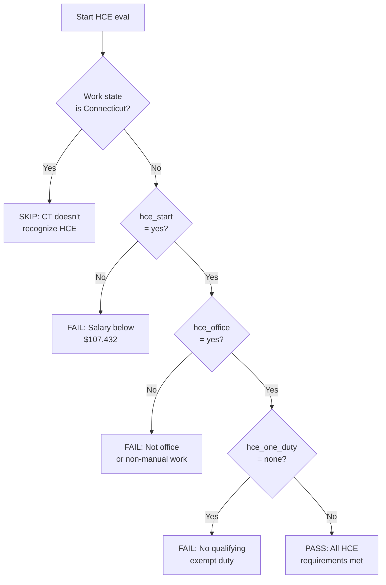
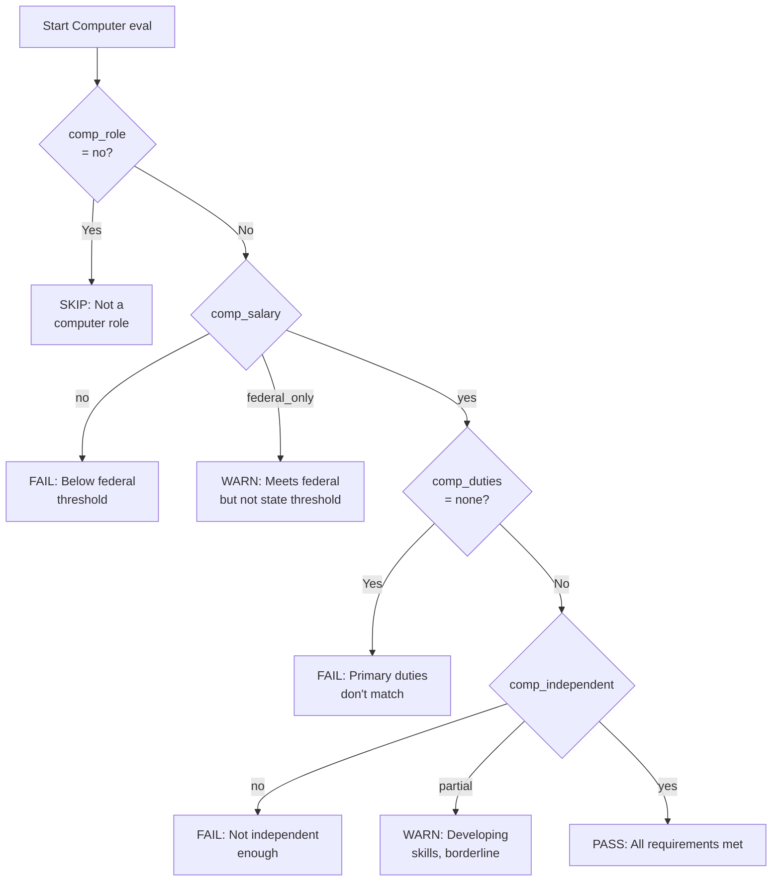
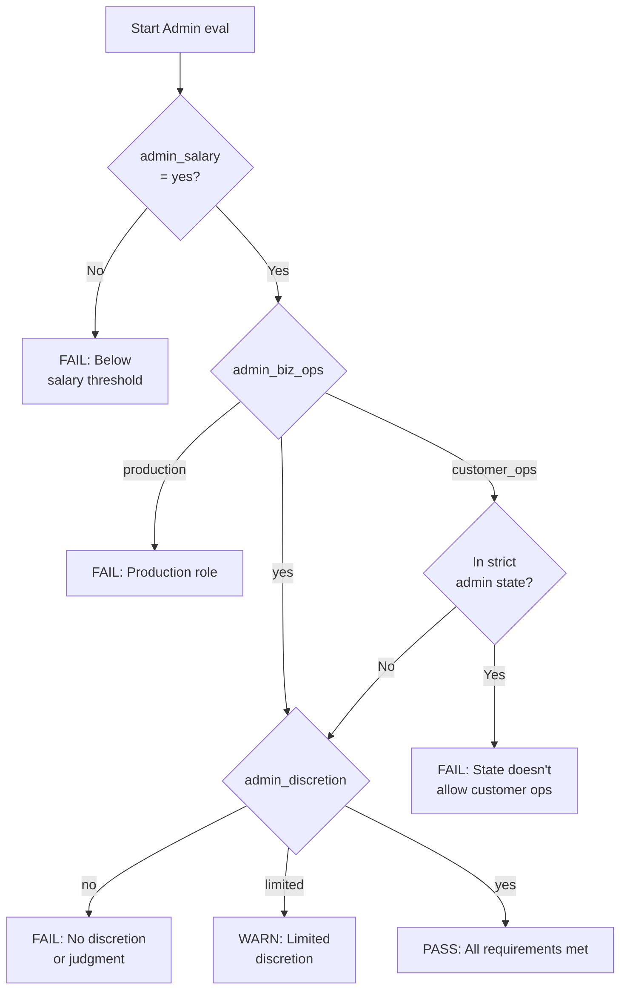
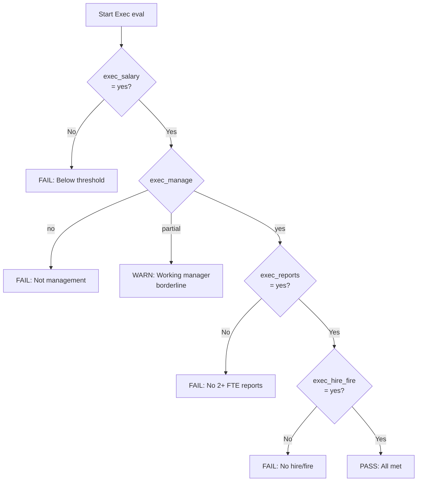
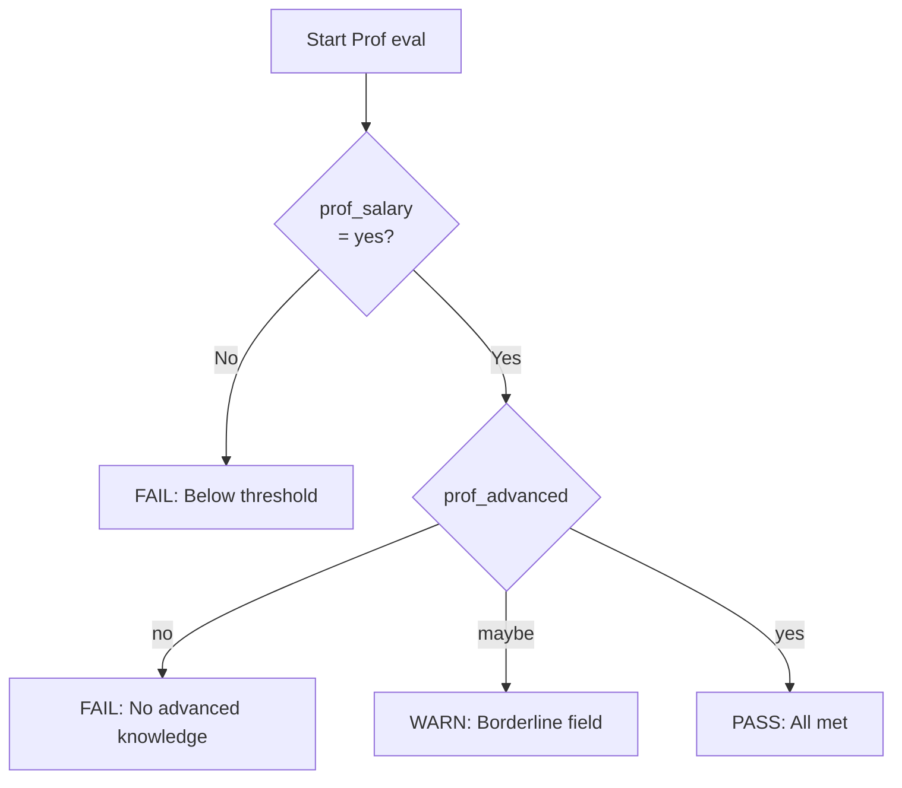
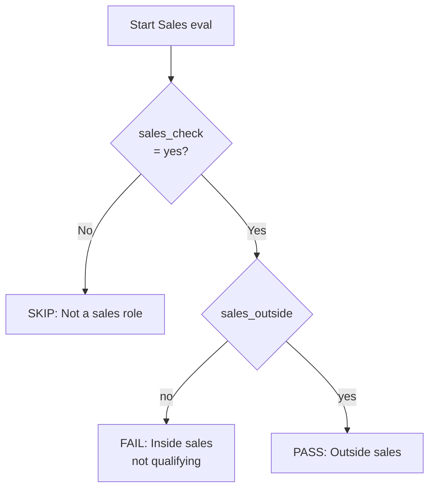

# 06 — Evaluation Logic

This document specifies how each exemption is evaluated based on the user's answers. The rules here are exhaustive: every possible answer combination produces a specific result.

---

## Result Object Structure

Each exemption evaluation produces a result object:

```
{
  status: "pass" | "fail" | "warn" | "skip",
  title: string,        // Human-readable exemption name
  summary: string,      // One-sentence outcome summary
  details: string[]     // Array of test outcomes, e.g., ["Salary test: PASS", "Duties test: FAIL"]
}
```

Status meanings:

- **pass:** Employee meets ALL requirements for this exemption
- **fail:** Employee does not meet one or more requirements (clear failure)
- **warn:** BORDERLINE status; legal review recommended
- **skip:** Exemption not applicable (e.g., Computer for non-technical role)

---

## Evaluation Order

The tool evaluates all six exemptions. Each is independent; the result of one does not affect another. A user may qualify under multiple exemptions (e.g., Executive AND HCE); the tool reports all passing exemptions.

Evaluation order for result rendering:

1. HCE
2. Computer Employee
3. Administrative
4. Executive
5. Learned Professional
6. Outside Sales

---

## HCE Evaluation



### Evaluation Rules

**Rule 1: Connecticut exclusion**
```
IF stateKey === "connecticut":
  status = "skip"
  title = "Highly Compensated Employee (HCE)"
  summary = "Not available in Connecticut. State law does not recognize the HCE exemption."
  details = []
```

**Rule 2: Salary test failure**
```
ELSE IF answers.hce_start === "no":
  status = "fail"
  summary = "Total compensation ($[TOTAL_COMP]) is below the $107,432 threshold."
  details = ["Salary test: FAIL"]
```

**Rule 3: Office work test failure**
```
ELSE IF answers.hce_office === "no":
  status = "fail"
  summary = "Employee does not perform office or non-manual work as primary duty."
  details = ["Compensation test: PASS", "Office work test: FAIL"]
```

**Rule 4: Duty test failure**
```
ELSE IF answers.hce_one_duty === "none":
  status = "fail"
  summary = "Employee does not customarily and regularly perform at least one exempt duty."
  details = ["Compensation test: PASS", "Office work test: PASS", "Exempt duty test: FAIL"]
```

**Rule 5: Full pass**
```
ELSE IF all of:
  answers.hce_start === "yes"
  answers.hce_office === "yes"
  answers.hce_one_duty is defined and not "none"
:
  status = "pass"
  summary = "Employee meets all HCE requirements."
  details = [
    "Compensation test: PASS",
    "Office work test: PASS",
    "Exempt duty test: PASS ([DUTY_TYPE])"
  ]
```

Where `[DUTY_TYPE]` is the selected duty value (e.g., "manages", "admin_discretion", "advanced_knowledge").

**Rule 6: Incomplete evaluation fallback**
```
ELSE:
  status = "skip"
  summary = "Not fully evaluated (skipped due to prior answers)."
  details = []
```

---

## Computer Employee Evaluation



### Evaluation Rules

**Rule 1: Not a computer role**
```
IF answers.comp_role === "no":
  status = "skip"
  title = "Computer Employee"
  summary = "Role is not a computer-related position. Exemption not applicable."
  details = []
```

**Rule 2: Salary below federal threshold**
```
ELSE IF answers.comp_salary === "no":
  status = "fail"
  summary = "Does not meet the federal compensation threshold."
  details = ["Role type: Computer-related", "Compensation test: FAIL"]
```

**Rule 3: Duties don't match**
```
ELSE IF answers.comp_duties === "none":
  status = "fail"
  summary = "Primary duties do not match the required computer employee functions."
  details = ["Role type: Computer-related", "Compensation test: PASS", "Duties test: FAIL"]
```

**Rule 4: Not independent**
```
ELSE IF answers.comp_independent === "no":
  status = "fail"
  summary = "Employee does not work independently with sufficient skill and expertise."
  details = [
    "Role type: Computer-related",
    "Compensation test: PASS",
    "Duties test: PASS",
    "Independence/skill test: FAIL"
  ]
```

**Rule 5: Partial independence (borderline)**
```
ELSE IF answers.comp_independent === "partial":
  status = "warn"
  summary = "BORDERLINE: Employee has developing skills but still requires significant supervision. Legal review recommended."
  details = [
    "Role type: Computer-related",
    "Compensation test: PASS",
    "Duties test: PASS",
    "Independence/skill test: BORDERLINE"
  ]
```

**Rule 6: Federal only (state threshold not met)**
```
ELSE IF answers.comp_salary === "federal_only":
  status = "warn"
  summary = "Meets federal threshold but NOT [STATE_LABEL] state threshold. Employee is exempt under federal law but may not be exempt under state law. Apply the more protective standard: classify as NON-EXEMPT for overtime purposes."
  details = [
    "Role type: Computer-related",
    "Federal compensation: PASS",
    "[STATE_LABEL] compensation: FAIL",
    "Duties test: PASS",
    "Independence test: PASS"
  ]
```

**Rule 7: Full pass**
```
ELSE IF all of:
  answers.comp_role === "yes"
  answers.comp_salary === "yes"
  answers.comp_duties is defined and not "none"
  answers.comp_independent === "yes"
:
  status = "pass"
  summary = "Employee meets all computer employee exemption requirements (federal and applicable state)."
  details = [
    "Role type: Computer-related",
    "Compensation test: PASS (federal + state)",
    "Duties test: PASS",
    "Independence/skill test: PASS"
  ]
```

**Rule 8: Fallback**
```
ELSE:
  status = "skip"
  summary = "Not fully evaluated."
  details = []
```

**Important ordering note:** Rules 4 and 5 (the "no" and "partial" independence paths) must be evaluated BEFORE Rule 6 (the "federal_only" salary path). This ensures that an employee with partial independence is marked borderline for the independence issue even if their salary is federal-only.

---

## Administrative Evaluation



### Evaluation Rules

**Rule 1: Salary fails**
```
IF answers.admin_salary === "no":
  status = "fail"
  title = "Administrative"
  summary = "Does not meet the applicable salary threshold."
  details = ["Salary test: FAIL"]
```

**Rule 2: Production role**
```
ELSE IF answers.admin_biz_ops === "production":
  status = "fail"
  summary = "Primary duty is production/delivery of the company's core product, not management or general business operations."
  details = ["Salary test: PASS", "Business operations test: FAIL (production role)"]
```

**Rule 3: Customer ops in strict state**
```
ELSE IF answers.admin_biz_ops === "customer_ops" AND stateKey IN STRICT_ADMIN_STATES:
  status = "fail"
  summary = "Primary duty relates to customer operations. [STATE_LABEL] does not allow the administrative exemption for customer-facing duties."
  details = [
    "Salary test: PASS",
    "Business operations test: FAIL under [STATE_LABEL] law (customer-facing)",
    "Note: Would pass under federal law but state law is more restrictive"
  ]
```

**Rule 4: No discretion**
```
ELSE IF answers.admin_discretion === "no":
  status = "fail"
  summary = "Employee does not exercise discretion and independent judgment on matters of significance."
  details = [
    "Salary test: PASS",
    "Business operations test: PASS",
    "Discretion & independent judgment: FAIL"
  ]
```

**Rule 5: Limited discretion (borderline)**
```
ELSE IF answers.admin_discretion === "limited":
  status = "warn"
  summary = "BORDERLINE: Employee exercises some judgment but most significant decisions require approval. Legal review recommended."
  details = [
    "Salary test: PASS",
    "Business operations test: PASS",
    "Discretion & independent judgment: BORDERLINE"
  ]
```

**Rule 6: Full pass**
```
ELSE IF all of:
  answers.admin_salary === "yes"
  (
    answers.admin_biz_ops === "yes"
    OR
    (answers.admin_biz_ops === "customer_ops" AND stateKey NOT IN STRICT_ADMIN_STATES)
  )
  answers.admin_discretion === "yes"
:
  status = "pass"
  note = " (via customer operations, federal standard)" IF customer_ops ELSE ""
  summary = "Employee meets all administrative exemption requirements." + note
  details = [
    "Salary test: PASS",
    "Business operations test: PASS" + note,
    "Discretion & independent judgment: PASS"
  ]
```

**Rule 7: Fallback**
```
ELSE:
  status = "skip"
  summary = "Not fully evaluated."
  details = []
```

---

## Executive Evaluation



### Evaluation Rules

**Rule 1: Salary fails**
```
IF answers.exec_salary === "no":
  status = "fail"
  title = "Executive"
  summary = "Does not meet the applicable salary threshold."
  details = ["Salary test: FAIL"]
```

**Rule 2: Not management**
```
ELSE IF answers.exec_manage === "no":
  status = "fail"
  summary = "Primary duty is not management."
  details = ["Salary test: PASS", "Management as primary duty: FAIL"]
```

**Rule 3: Not 2+ FTE reports**
```
ELSE IF answers.exec_reports === "no":
  status = "fail"
  summary = "Does not direct the work of 2+ FTE employees."
  details = [
    "Salary test: PASS",
    "Management as primary duty: PASS",
    "2+ FTE direct reports: FAIL"
  ]
```

**Rule 4: No hire/fire authority**
```
ELSE IF answers.exec_hire_fire === "no":
  status = "fail"
  summary = "Does not have hire/fire authority or recommendations that carry particular weight."
  details = [
    "Salary test: PASS",
    "Management as primary duty: PASS",
    "2+ FTE direct reports: PASS",
    "Hire/fire authority: FAIL"
  ]
```

**Rule 5: Working manager (borderline)**
```
ELSE IF answers.exec_manage === "partial":
  status = "warn"
  summary = "BORDERLINE: Employee manages but also performs substantial non-management work (working manager). Need to determine if management is truly the \"primary\" duty."
  details = [
    "Salary test: PASS",
    "Management as primary duty: BORDERLINE (working manager)",
    "2+ FTE direct reports: PASS" (if exec_reports === "yes" else "N/A"),
    "Hire/fire authority: PASS" (if exec_hire_fire === "yes" else "N/A")
  ]
```

**Rule 6: Full pass**
```
ELSE IF all of:
  answers.exec_salary === "yes"
  answers.exec_manage === "yes"
  answers.exec_reports === "yes"
  answers.exec_hire_fire === "yes"
:
  status = "pass"
  summary = "Employee meets all executive exemption requirements."
  details = [
    "Salary test: PASS",
    "Management as primary duty: PASS",
    "2+ FTE direct reports: PASS",
    "Hire/fire authority: PASS"
  ]
```

**Rule 7: Fallback**
```
ELSE:
  status = "skip"
  summary = "Not fully evaluated."
  details = []
```

**Ordering note:** Rules 3 and 4 (specific failures) must be checked BEFORE Rule 5 (partial borderline) to ensure clear failures are reported as failures, not borderlines.

---

## Learned Professional Evaluation



### Evaluation Rules

**Rule 1: Salary fails**
```
IF answers.prof_salary === "no":
  status = "fail"
  title = "Learned Professional"
  summary = "Does not meet the applicable salary threshold."
  details = ["Salary test: FAIL"]
```

**Rule 2: No advanced knowledge**
```
ELSE IF answers.prof_advanced === "no":
  status = "fail"
  summary = "Role does not require advanced knowledge in a recognized learned profession."
  details = ["Salary test: PASS", "Advanced knowledge requirement: FAIL"]
```

**Rule 3: Borderline field**
```
ELSE IF answers.prof_advanced === "maybe":
  status = "warn"
  summary = "BORDERLINE: Role requires a specific degree but the field may not be a traditional learned profession. Legal review recommended."
  details = ["Salary test: PASS", "Advanced knowledge requirement: BORDERLINE"]
```

**Rule 4: Full pass**
```
ELSE IF answers.prof_salary === "yes" AND answers.prof_advanced === "yes":
  status = "pass"
  summary = "Employee meets learned professional exemption requirements."
  details = ["Salary test: PASS", "Advanced knowledge requirement: PASS"]
```

**Rule 5: Fallback**
```
ELSE:
  status = "skip"
  summary = "Not fully evaluated."
  details = []
```

---

## Outside Sales Evaluation



### Evaluation Rules

**Rule 1: Not a sales role**
```
IF answers.sales_check === "no":
  status = "skip"
  title = "Outside Sales"
  summary = "Not a sales role. Exemption not applicable."
  details = []
```

**Rule 2: Inside sales**
```
ELSE IF answers.sales_outside === "no":
  status = "fail"
  summary = "Employee does not primarily make sales away from the employer's place of business."
  details = ["Sales role: YES", "Outside sales primary duty: FAIL (inside sales/remote)"]
```

**Rule 3: Outside sales (pass)**
```
ELSE IF answers.sales_outside === "yes":
  status = "pass"
  summary = "Employee meets outside sales exemption requirements. No salary threshold applies."
  details = ["Sales role: YES", "Outside sales primary duty: PASS"]
```

**Rule 4: Fallback**
```
ELSE:
  status = "skip"
  summary = "Not evaluated."
  details = []
```

---

## Overall Classification Determination

After all six exemptions are evaluated, the tool determines the overall classification:

### Step 1: Count Outcomes

```
passing = list of exemption titles where status === "pass"
borderline = list of exemption titles where status === "warn"
isExempt = passing.length > 0
hasBorderline = borderline.length > 0
```

### Step 2: Generate Recommendation

**Case A: Exempt (at least one clean pass)**
```
recommendation = "RECOMMEND: Classify as EXEMPT under the [PASSING_EXEMPTIONS] exemption[s] (federal[ and [STATE_LABEL] state]).

Note: Additional exemptions are borderline ([BORDERLINE_LIST]). The qualifying exemption[s] above [is/are] sufficient, but borderline results are documented below." (only include second paragraph if hasBorderline)
```

**Case B: Borderline only (no clean pass, but at least one warn)**
```
recommendation = "RECOMMEND: LEGAL REVIEW REQUIRED. No exemption clearly passed, but [BORDERLINE_LIST] exemption[s] [is/are] borderline. Recommend consulting employment counsel before classifying."
```

**Case C: Clear non-exempt**
```
recommendation = "RECOMMEND: Classify as NON-EXEMPT. This role does not meet the requirements for any tested exemption under federal or [STATE_LABEL] state law. The employee is entitled to overtime pay."
```

Where:
- `[PASSING_EXEMPTIONS]` = passing exemption titles joined with " and "
- `[BORDERLINE_LIST]` = borderline exemption titles joined with " and " (or ", " for 3+)
- `[STATE_LABEL]` = full state label (e.g., "California") if not federal
- `is/are` matches plurality of passing exemptions

---

## Risk Flags

After generating the recommendation, the tool produces a list of risk flags based on conditions met during evaluation. Each flag is a separate string. They appear in the "Risk Flags & Considerations" section of the memo.

### Flag 1: Borderline Exemptions
```
FOR each borderline exemption:
  ADD: "The [EXEMPTION_NAME] exemption is borderline. Document the specific duties analysis and consider legal review."
```

### Flag 2: Federal-Only Computer Threshold
```
IF answers.comp_salary === "federal_only":
  ADD: "Employee meets federal computer employee threshold but NOT [STATE_LABEL] state threshold. Apply the more protective state standard."
```

### Flag 3: Customer Ops (when not in strict state)
```
IF answers.admin_biz_ops === "customer_ops" AND stateKey NOT IN STRICT_ADMIN_STATES:
  ADD: "Administrative exemption based on customer operations work. This qualifies under federal law but would NOT qualify in states like New York or Oregon. If the employee relocates to those states, reclassification may be needed."
```

### Flag 4: Working Manager
```
IF answers.exec_manage === "partial":
  ADD: "Working manager/player-coach role. If the non-management duties consume more than 50% of time, the \"primary duty\" test could fail under scrutiny."
```

### Flag 5: Below State EAP Threshold
```
IF empData.baseSalary < stateThreshold.eapAnnual AND stateThreshold.eapAnnual > 35568:
  ADD: "Employee salary ($[BASE_SALARY]) is below the [STATE_LABEL] state EAP threshold ($[STATE_THRESH]). Even if duties tests pass, the state salary test fails."
```

### Flag 6: Reclassification Review
```
IF empData.classType === "reclass":
  ADD: "This is a reclassification review. If changing from exempt to non-exempt, plan a communication strategy to address employee concerns about the change (timekeeping requirements, perception of status change). Position it as a compliance benefit."
```

---

## Overtime Rules Generation

If the final recommendation is NON-EXEMPT (or BORDERLINE), the memo includes an Overtime Rules section. This is generated based on work state:

**Base (always included):**
```
Federal: Overtime required for non-exempt employees working more than 40 hours in a workweek at 1.5x the regular rate of pay.
```

**California addition:**
```
California: Overtime required for more than 8 hours in a day AND more than 40 hours in a week. Double time required for more than 12 hours in a day and more than 8 hours on the 7th consecutive day in a workweek.
```

**Colorado addition:**
```
Colorado: Overtime required for more than 12 hours in a day OR more than 40 hours in a week (note: different from California's 8-hour daily trigger).
```

**Always appended (regardless of state):**
```
Regular Rate Reminder: When calculating overtime, the "regular rate" must include all non-discretionary compensation (bonuses, commissions, shift differentials). Only truly discretionary bonuses may be excluded.
```

---

## Test Scenarios

Below are example inputs and expected outcomes. A builder should use these to verify correct implementation.

### Scenario 1: California Software Engineer, Below State Threshold

**Input:**
- Work state: California
- Base salary: $90,000
- Total comp: $100,000
- Role: Software Engineer (independent, full duties)

**Expected:**
- HCE: FAIL (comp below $107,432)
- Computer: WARN (federal_only, state threshold $122,573.13 not met)
- Admin: FAIL (production role)
- Executive: FAIL (not management)
- Professional: FAIL (not traditional learned profession)
- Outside Sales: SKIP
- **Recommendation:** LEGAL REVIEW REQUIRED (borderline Computer exemption)
- **Risk Flag:** Federal-only computer threshold

### Scenario 2: Texas Senior Engineering Manager

**Input:**
- Work state: Texas
- Base salary: $180,000
- Total comp: $250,000
- Role: Eng Manager with 5 direct reports, hiring authority

**Expected:**
- HCE: PASS (comp ≥ $107,432, office work, manages = exempt duty)
- Computer: Depends on duties (likely SKIP if they don't code)
- Admin: FAIL (production-adjacent)
- Executive: PASS (all 4 prongs met)
- Professional: FAIL
- Outside Sales: SKIP
- **Recommendation:** EXEMPT under HCE and Executive exemptions

### Scenario 3: Connecticut Senior Director

**Input:**
- Work state: Connecticut
- Base salary: $220,000
- Total comp: $300,000
- Role: Director of Marketing, 8 direct reports

**Expected:**
- HCE: SKIP (CT doesn't recognize)
- Computer: SKIP (not technical)
- Admin: PASS (business ops, discretion)
- Executive: PASS (management + reports + hire/fire)
- Professional: FAIL
- Outside Sales: SKIP
- **Recommendation:** EXEMPT under Administrative and Executive

### Scenario 4: Inside Sales Rep, Anywhere

**Input:**
- Work state: Texas
- Base salary: $55,000
- Total comp: $85,000
- Role: SDR, closes deals from office

**Expected:**
- HCE: FAIL
- Computer: SKIP
- Admin: FAIL (production/sales)
- Executive: FAIL
- Professional: FAIL
- Outside Sales: FAIL (inside sales)
- **Recommendation:** NON-EXEMPT

### Scenario 5: New York City Compliance Officer Serving Clients

**Input:**
- Work state: New York (NYC/Nassau/Suffolk/Westchester)
- Base salary: $140,000
- Total comp: $160,000
- Role: Client-facing compliance consultant

**Expected:**
- HCE: PASS (comp ≥ $107,432, office, admin discretion)
- Computer: SKIP
- Admin: FAIL (customer_ops in strict state)
- Executive: FAIL
- Professional: Depends on credentials
- Outside Sales: SKIP
- **Recommendation:** EXEMPT under HCE (HCE overrides strict admin for NY; HCE's relaxed duties test still applies)

**Note on Scenario 5:** This is an interesting edge case. HCE uses a relaxed duties test that asks whether the employee performs ONE exempt duty, without the NY-specific customer-ops restriction. The full NY admin exemption fails, but HCE passes. The tool correctly handles this because the NY restriction only applies to the Administrative exemption evaluation, not HCE.

---

## Implementation Guidance

The evaluation logic should be implemented as pure functions, one per exemption, that take the answers object and state threshold as inputs and return a result object. This enables:

- Easy testing (input in, expected result out)
- Modularity (one exemption's logic doesn't depend on another)
- Clarity (one function = one exemption)

Avoid mixing evaluation logic with UI rendering. The output should be a data structure that the memo generator consumes.

Continue to `07-memo-output.md`.
