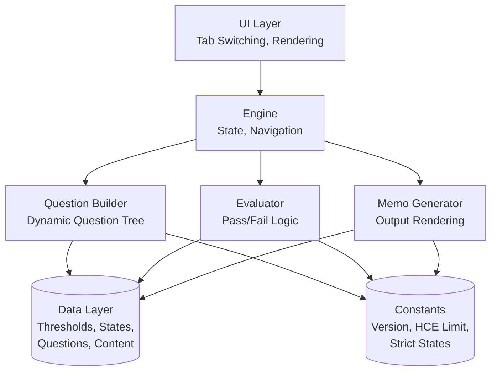
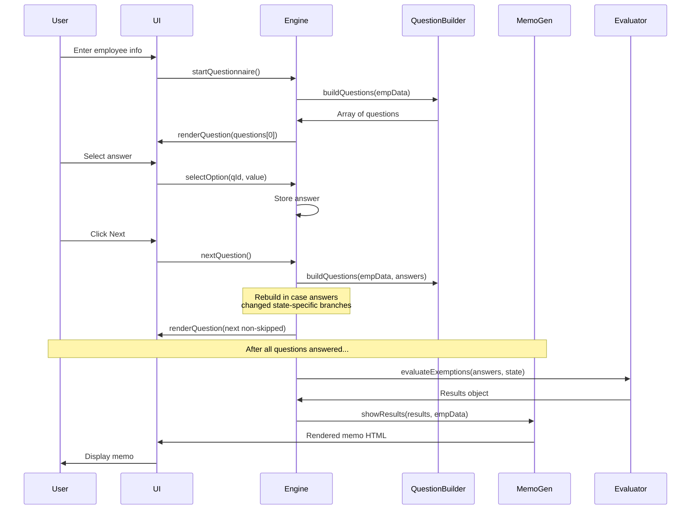

# 08 — UI and Architecture

This document specifies the user interface layout, visual design, and architecture. It is stack-agnostic: the requirements describe behavior, not specific technologies. An appendix at the end describes the original vanilla JavaScript implementation for reference.

---

## Visual Design System

### Design Philosophy

- **Professional, not flashy.** Internal HR compliance tool aesthetic.
- **Clarity over cleverness.** The tool must communicate legal information without confusion.
- **Minimal decoration.** No gradients, animations, illustrations beyond simple icons.
- **Consistent.** Same visual treatments for same UI elements throughout.

### Color System

All colors should be defined as variables (CSS custom properties or equivalent in your stack) for easy theming.

| Variable | Hex | Usage |
|----------|-----|-------|
| `--bg` | `#f7f8fa` | Page background |
| `--surface` | `#ffffff` | Cards, panels, inputs |
| `--surface-alt` | `#f0f2f5` | Secondary buttons, subtle backgrounds |
| `--border` | `#e0e3e8` | Default borders |
| `--border-focus` | `#3b6fe0` | Focus state borders |
| `--text` | `#1a1d23` | Primary text |
| `--text-secondary` | `#5f6672` | Secondary text, labels |
| `--text-muted` | `#8b919d` | Tertiary text, placeholders, version info |
| `--accent` | `#3b6fe0` | Primary brand color, buttons, highlights |
| `--accent-light` | `#e8eefb` | Accent backgrounds, selected options |
| `--accent-hover` | `#2d5bc7` | Hover state for accent buttons |
| `--green` | `#1a8c5b` | Pass status |
| `--green-bg` | `#e6f5ee` | Pass status background |
| `--red` | `#c73a3a` | Fail status |
| `--red-bg` | `#fce8e8` | Fail status background |
| `--amber` | `#b07c10` | Warning / borderline status |
| `--amber-bg` | `#fef5e0` | Warning background |
| `--purple` | `#7c3aed` | Question category badge |
| `--purple-bg` | `#f0ebfe` | Badge background |

### Typography

- **Body font:** DM Sans, system-ui fallback. Fetched from Google Fonts.
- **Monospace font:** JetBrains Mono. Used for dates, numbers in tables, version info.
- **Base size:** 16px (browser default)
- **Line height:** 1.6 for body text, 1.5 for UI elements
- **Weights used:** 400 (regular), 500 (medium), 600 (semibold), 700 (bold)

### Spacing

Consistent spacing scale (approximate multiples of 4px):

- 4px, 6px, 8px, 12px, 16px, 20px, 24px, 32px, 48px

### Shape

- **Border radius:** 8px for cards, 6px for buttons and inputs, 99px (pill) for badges, 50% for status dots
- **Shadow:** Three levels
  - `--shadow-sm`: Subtle shadow for cards (`0 1px 3px rgba(0,0,0,0.06)`)
  - `--shadow-md`: Slightly stronger for memo output (`0 4px 12px rgba(0,0,0,0.08)`)
  - `--shadow-lg`: Prominent, rarely used (`0 8px 24px rgba(0,0,0,0.1)`)

---

## Layout

### Page Structure

```
┌─────────────────────────────────────────────────────┐
│  APP HEADER (sticky)                                 │
│  ● FLSA Exemption Classification Tool   [Last Updated]│
├─────────────────────────────────────────────────────┤
│                                                      │
│  ┌─────────────┬─────────────┐                      │
│  │ Questionnaire│ Regulatory  │ ← Tab Bar            │
│  └─────────────┴─────────────┘                      │
│                                                      │
│  ┌─────────────────────────────────┐                │
│  │ Progress Bar                     │                │
│  │ [Info]──[HCE]──[Comp]──[...]    │                │
│  └─────────────────────────────────┘                │
│                                                      │
│  ┌─────────────────────────────────┐                │
│  │                                  │                │
│  │  Main Content Area               │                │
│  │  (Employee Info / Questions /    │                │
│  │   Results)                       │                │
│  │                                  │                │
│  └─────────────────────────────────┘                │
│                                                      │
└─────────────────────────────────────────────────────┘
```

### Container Constraints

- **Max width:** 900px centered (enough for comfortable reading, not so wide that forms look barren)
- **Horizontal padding:** 24px on larger screens, 16px on mobile
- **Vertical padding:** 24px top, 80px bottom (extra bottom for comfort when questions anchor to top)

### Header

- Sticky at top
- White background, bottom border
- Left: tool title with small accent-colored dot (●) as decoration
- Right: "Last Updated: [DATE]" in monospace, smaller, muted

### Tab Bar

- White background, light border, rounded corners
- Two equal-width tabs
- Active tab: accent color background, white text
- Inactive tab: transparent background, secondary text color
- Hover: light background on inactive tabs

### Progress Bar

Appears only in the Questionnaire tab. Structure:

```
[●1 Employee Info]──[○2 HCE]──[○3 Comp]──[○4 Admin]──[○5 Exec]──[○6 Prof]──[○7 Results]
```

- **Done stages:** Green checkmark in green-bordered circle, text in green
- **Active stage:** Number in accent-bordered circle with accent-light background, text in accent color, bold
- **Future stages:** Number in gray-bordered circle, text in muted gray
- **Connectors (lines between):** Green if the preceding stage is done, gray otherwise

On mobile (< 640px), labels can be hidden leaving only dots.

### Cards and Question Cards

All content sections use a consistent card treatment:

- White background
- 1px solid border
- 8px border radius
- Subtle shadow (`--shadow-sm`)
- Internal padding: 24px
- 16px margin-bottom between cards

Question cards have an additional fade-in animation when first displayed.

---

## Components

### Input Fields

**Text inputs and selects:**

- 10px-12px padding
- 1px solid border (`--border`)
- 6px border radius
- 14px font size
- Transition on border color
- Focus: `--border-focus` color, 3px outer glow in accent color at 10% opacity

**Labels:** 13px, semibold, secondary text color, above input

### Buttons

**Primary button:**
- Accent background, white text
- 10px 20px padding
- 6px border radius
- 14px font, 600 weight
- Hover: darker accent
- Disabled: 50% opacity, not-allowed cursor

**Secondary button:**
- `--surface-alt` background
- Primary text color
- 1px border
- Same dimensions as primary
- Hover: `--border` background

**Button row:**
- Flex layout
- Space-between alignment
- 16px top margin

### Option Buttons (for question answers)

Each answer option is a full-width button:

- White background, light border
- 12px 16px padding
- 6px border radius
- Left-aligned text
- Contains a radio-style indicator (18px circle) and the option label
- Hover: border becomes accent, background becomes accent-light
- Selected: border accent, background accent-light, radio filled with accent, inner white dot

Options are stacked vertically with 8px gap.

### Badges

Used for category labels (e.g., "Computer Exemption" on a question).

- Pill shape (99px radius)
- 3px 10px padding
- 12px font, 600 weight
- Colored variants: green, red, amber, purple (mapped to status)

### Collapsible Sections

Used for the "Why are we asking this?" content:

- Toggle button: small, accent color, left-aligned, with arrow indicator
- Content hidden by default
- When open: accent-light background, 3px accent-colored left border, 12px-14px padding
- Smooth show/hide (immediate toggle is acceptable; CSS transition optional)

### Status Blocks (in Memo)

Exemption analysis blocks:

- Padding: 12px 16px
- Border radius: 6px
- 3px left border in status color (green/red/amber/gray)
- Background in status-light color
- Result header bold with icon and exemption title
- Details indented (24px padding-left for detail items)

### Progress Dots

- 24px × 24px
- 50% border radius (circular)
- 2px border
- Content: number or checkmark, 11px font, 700 weight

### Animations

**Question fade-in:** When a new question is rendered, it fades in with 8px upward translation:

```
from: opacity 0, translateY(8px)
to:   opacity 1, translateY(0)
duration: 200ms
```

No other animations required. Avoid excessive motion for this compliance tool.

---

## Responsive Behavior

### Breakpoints

- **Desktop:** ≥ 640px (default)
- **Mobile:** < 640px

### Mobile Adjustments

- Form grid becomes single column
- Progress bar overflows horizontally with scroll
- Progress step labels hidden, leaving only dots
- App header padding reduced to 12px 16px
- Page padding reduced to 16px
- Memo rows stack vertically (label above value instead of side-by-side)

The tool should remain functional on mobile but is optimized for desktop use (as befits an HR back-office tool).

---

## Print Stylesheet

When the user prints:

**Hidden:**
- App header
- Tab bar
- Progress bar
- Action buttons (`.btn-row`)
- Anything with class `.no-print`

**Shown:**
- Memo content

**Modifications:**
- Body background: white
- Memo output: no shadow, no border, 0 padding (browser provides margins)
- App layout: full width, 0 padding

---

## Architecture

### High-Level Architecture



### Separation of Concerns

The tool must maintain clean separation between:

1. **Data** (static information): thresholds, state lists, regulatory content, constants
2. **Configuration** (questionnaire definition): question objects with IDs, labels, options, skip logic
3. **Logic** (evaluation): pure functions that convert answers to results
4. **Presentation** (UI rendering): DOM/component rendering, event handling
5. **State management** (session data): current question, collected answers, employee data

Each layer should depend only on layers below it. The presentation layer should not contain logic; the logic layer should not manipulate the DOM.

### Data Flow



### State Management

The tool maintains these pieces of state:

1. **Current tab:** "classify" or "regulatory"
2. **Current stage:** "info", "questions", or "results"
3. **Employee data:** Collected in the intake form
4. **Questions:** Dynamically built based on employee data
5. **Current question index:** Integer pointing into questions array
6. **Answers:** Object keyed by question ID
7. **Exemption results:** Produced after all questions answered

No persistence across sessions is required. Closing the browser loses all state.

### Question Tree Rebuilding

Important architectural detail: the question tree is REBUILT when:

1. The user clicks Next (to re-evaluate state-specific branches)
2. The user clicks Back (to re-evaluate skip conditions)

This is because some questions depend on earlier answers (e.g., the Connecticut HCE block question appears only if `workState` maps to `connecticut`, and the strict admin state question appears only for NY/OR).

Rebuilding is cheap (the question array is small) and ensures consistency.

---

## Appendix: Original Implementation Details (Vanilla JavaScript)

This section describes the ORIGINAL implementation of the tool. A rebuilder may choose a different stack, but this appendix provides reference for the original design decisions.

### Original Technology Stack

- **HTML5** for markup
- **CSS3** with custom properties (variables) for styling
- **Vanilla JavaScript** (ES2015+) with no frameworks
- **Google Fonts** for typography (DM Sans, JetBrains Mono)
- **No build step, no package manager, no transpiler**

### File Structure

```
flsa-project/
├── index.html
├── README.md
├── css/
│   ├── base.css          # Variables, typography, layout
│   ├── components.css    # Tabs, cards, buttons, forms, questions
│   └── memo.css          # Memo output styles
├── data/
│   ├── thresholds.js     # Threshold data (annual updates)
│   ├── states.js         # States list and mapping
│   ├── regulatory.js     # Regulatory landscape content
│   └── questions.js      # Decision tree (buildQuestions function)
└── js/
    ├── engine.js         # State management, navigation
    ├── evaluator.js      # Pass/fail logic
    ├── memo.js           # Memo generation
    ├── ui.js             # DOM rendering
    └── app.js            # Entry point, init
```

### Loading Order in index.html

Scripts load in this order (dependencies must be defined before use):

1. All data files first (thresholds, states, regulatory, questions)
2. Then logic files (engine, evaluator, memo, ui)
3. Finally the app entry point (app.js)

### Key Implementation Patterns

#### 1. Global Variables (Module-Less)

Instead of ES modules with import/export, the original uses global variables and functions. Each file defines top-level constants and functions that become globally accessible when the script loads.

Trade-off: Simpler, no build step, but less encapsulated. Acceptable for this tool size.

#### 2. Questions as Data + Function

The questions are generated by a function `buildQuestions(empData, answers)` rather than stored as pure data. This is because some question text includes dynamic values (employee's salary, state-specific thresholds). The function is called when starting the questionnaire and again on every navigation to re-evaluate skip conditions.

#### 3. Rendering via innerHTML

The UI renders by setting `innerHTML` on container elements, not by creating DOM nodes programmatically or using a virtual DOM. This is acceptable for the tool's modest interactivity.

#### 4. Event Handlers via onClick Attributes

Due to the innerHTML rendering approach, event handlers are attached via `onclick="..."` inline attributes referencing global functions. Not best practice for larger apps, but simple and clear for this tool.

#### 5. No Dependency Injection

Functions like `evaluateExemptions()` read from global `answers` and `empData` variables directly. Explicit parameter passing is only done where the function is genuinely reusable.

### Original Styling Approach

CSS custom properties are defined at `:root` for easy theming. Selectors are mostly class-based. No preprocessor (Sass, Less). No PostCSS. Plain CSS.

Media queries for responsive behavior at 640px.

---

## Stack Alternatives

A rebuilder is free to use any of these stacks without loss of functionality:

### React / Vue / Svelte

Map the stages to components (EmployeeInfoForm, Question, MemoOutput, etc.). State managed via framework state (useState, reactive, store). Threshold and question data imported as JSON or JS modules. Standard tailwind or similar for styling.

### Angular

Same concept, with Angular services for state management. Forms for employee info intake.

### Static Site Generator (Astro, Hugo, Eleventy)

Overkill for a single-page tool. Not recommended.

### Backend-Rendered (Rails, Django, etc.)

The original is fully client-side; making it backend-rendered adds complexity without benefit unless you need persistence or multi-user features.

### Native Mobile (iOS / Android)

Possible but unnecessary. The tool works in mobile browsers.

### Recommendation for Rebuilders

If you're using Claude Code or similar to rebuild:

- **For a one-file deliverable:** Vanilla HTML/CSS/JS (matches original).
- **For a developer team maintaining long-term:** React or Vue.
- **For integration into an existing HR app:** Match the host app's stack.

Continue to `09-maintenance-and-extension.md`.
